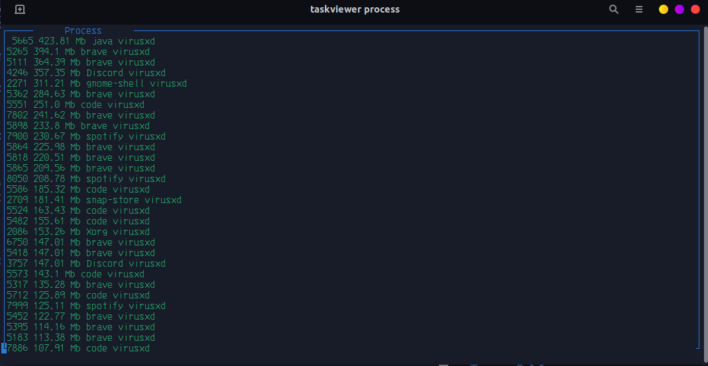
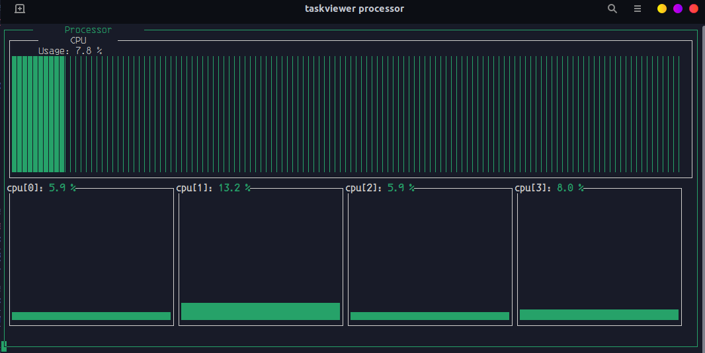
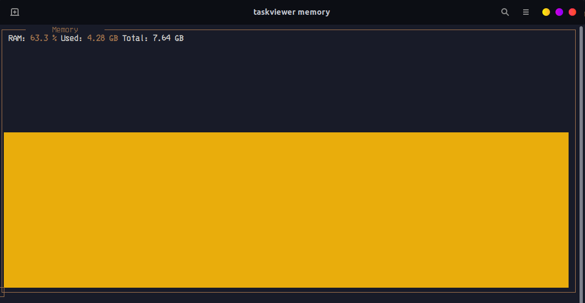
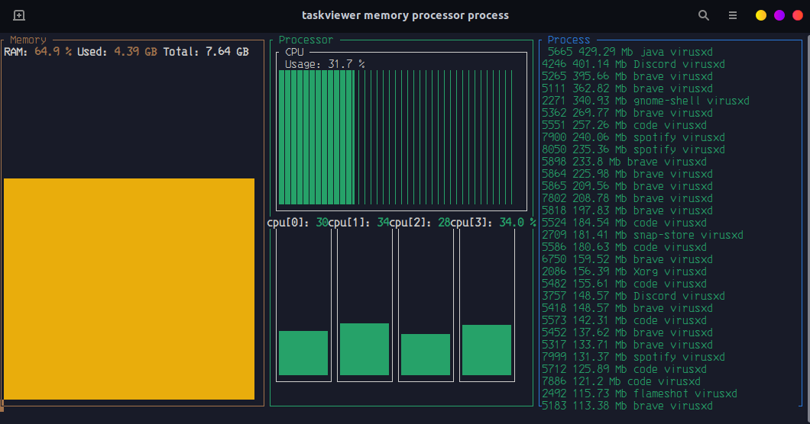

# Taskview 	:mag_right:


## Requirements :computer::
This project use a packaging and dependency management called [poetry](https://python-poetry.org/).
- Installation:

    `osx / linux / bashonwindows install instructions
    `

    ```bash
    curl -sSL https://raw.githubusercontent.com/python-poetry/poetry/master/get-poetry.py | python -
    ```
    `
    windows powershell install instructions
    `
    ```bash
    (Invoke-WebRequest -Uri https://raw.githubusercontent.com/python-poetry/poetry/master/get-poetry.py -UseBasicParsing).Content | python -
    ```
- Running:
    ```bash
    poetry install
    ```
    ```bash
    poetry shell
    ```
    ```bash
    taskviewer <arg> or <args>
    ```

## Documentation :scroll::
- The argument "process" command will show process running in you PC:
 
 

- The argument "processor" command will show the percentage of usage of your cores:



- The "memory" command will show percentage of memory RAM usage:

 
 
- Multiple arguments usage:

    example:

    ```bash
    taskviewer memory processor process
    ```

    

## Usage libraries :snake::
### [Psutil v5.9.1](https://psutil.readthedocs.io/en/latest/).
### [Black v22.6.0](https://pypi.org/project/black/).
### [Typer v0.4.1](https://typer.tiangolo.com/).
### [Py-Dashing v0.3.dev0](https://github.com/hemanthmalla/dashing).

## This project was based :handshake: :

### [Dudunossauro Channel](https://www.youtube.com/c/Dunossauro)
### [Video](https://www.youtube.com/watch?v=H32lpY8Jipo)

## Contributors :sparkles::
|[ <br> <sub> virusxdRJ </sub>](https://github.com/joaooliveira247)|
|:---:|
|[](https://www.linkedin.com/in/joaooliveira247/) |
